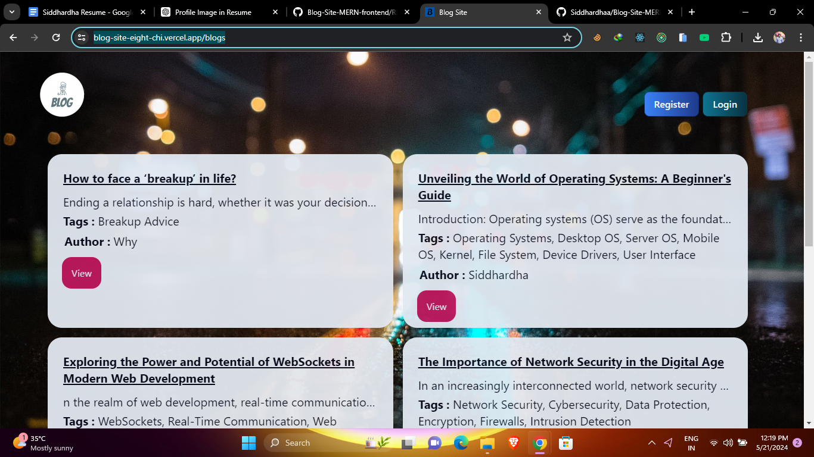

# Blog Site

Welcome to the Blog Site repository! This project hosts a collection of blogs on various topics. You can explore the blogs [here](https://blog-site-eight-chi.vercel.app/blogs).

## Features

- **Interactive UI**: A user-friendly interface for browsing blogs.
- **Responsive Design**: Optimized for both desktop and mobile devices.
- **Dynamic Content**: Blogs are dynamically loaded for a seamless experience.

## Screenshots

### Homepage


### Blog Post

### Login Page

### Register Page


## Getting Started

### Prerequisites

Ensure you have the following installed:
- [Node.js](https://nodejs.org/) (v14 or higher)
- [npm](https://www.npmjs.com/)

### Installation

1. Clone the repository:
     ```sh
       git clone https://github.com/your-username/blog-site.git
       cd blog-site

2. Install dependencies:
   ```sh
      npm install
3. Running Locally
    ```sh
    #Start the development server:
    npm run
Navigate to http://localhost:3000 in your browser to see the blog site in action.
3. Deployment:
   Deploy the site using Vercel:

   Push your changes to GitHub.
   Link your repository to Vercel and deploy.
4. Contact
   For any inquiries, please reach out via email at siddhardhabattula1@gmail.com


  
